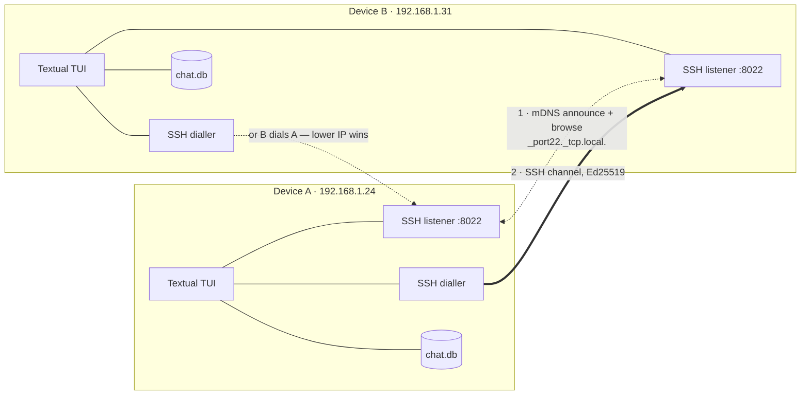

# Port22

[github.com/ahmedyar7/Port22](https://github.com/ahmedyar7/Port22)

Decentralised peer-to-peer chat over SSH. Two devices on the same LAN find each
other with mDNS and talk directly — no server, no accounts, no cloud, and no
custom cryptography. SSH is the entire transport and security layer.

Message history lives in a local SQLite file on each device. The UI is a
[Textual](https://textual.textualize.io/) TUI in your terminal.



Every device runs the *same* program: it listens for an incoming connection and
can dial out, both in one asyncio event loop.

## Requirements

- Python 3.13+
- [uv](https://docs.astral.sh/uv/)
- `ssh-keygen` (ships with Git for Windows and with Windows OpenSSH)
- Both devices on the same LAN, with multicast allowed

Dependencies, installed by `uv sync`: `asyncssh`, `textual`, `zeroconf`.

## Setup

```bash
git clone https://github.com/ahmedyar7/Port22.git
cd Port22
uv sync
```

### Generate keys

Keys and the database are gitignored, so a fresh clone has none. On **each**
device:

```bash
ssh-keygen -t ed25519 -f ssh_host_key -N ""   # this device's SSH host identity
ssh-keygen -t ed25519 -f client_key   -N ""   # this device's client identity
```

Use an **empty passphrase** — asyncssh loads these files unattended and cannot
prompt you for one.

### Exchange public keys

Each device must trust the other's *client* key. Copy the contents of
`client_key.pub` from device B into `authorized_keys` on device A, and the other
way round:

```bash
# on device A, after receiving B's client_key.pub
cat b_client_key.pub >> authorized_keys
```

`authorized_keys` is a plain allowlist, one key per line. Anyone not in it
cannot connect. If you are testing both peers on one machine, a single key pair
listed in both files works fine.

## Running

On both devices:

```bash
uv run peer.py
```

Each peer advertises itself on the LAN as `_port22._tcp.local.`, browses for the
other, and connects automatically:

```
Your address: 192.168.1.24:8022
Listening for incoming peers.
Advertising as laptop-8022._port22._tcp.local. (192.168.1.24:8022)
Searching for peers on the LAN...
Found peer: desktop-8022._port22._tcp.local. at 192.168.1.31:8022
Connected to 192.168.1.31:8022.
```

Then just type. `Ctrl+C` or `/quit` exits — the mDNS advertisement is withdrawn
on the way out, so the other side stops seeing a dead address.

### Commands

| Input | Effect |
| --- | --- |
| any text | send it to the connected peer |
| `connect <ip>` | dial a peer manually (the mDNS fallback) |
| `connect <ip> <port>` | dial a peer on a non-default port |
| `/quit` or `/exit` | close the app |

`connect <ip>` is the escape hatch for when mDNS is blocked. The app works
perfectly well with it and never depends on discovery succeeding.

## How it connects

1. **Listen.** The SSH server binds `0.0.0.0:8022` using `ssh_host_key`, with
   `authorized_keys` as the allowlist.
2. **Advertise.** Only once the listener is up, the peer registers
   `<hostname>-8022._port22._tcp.local.` on the LAN carrying its real LAN IP —
   found by opening a UDP socket toward a public address and reading back the
   interface the OS chose. Nothing is actually sent.
3. **Discover.** It browses for the same service type in repeated passes until a
   channel exists, filtering out its own advertisement by both instance name and
   IP so it never dials itself. Retrying means the two devices need not be
   started at the same moment.
4. **Dial.** Both sides discover each other simultaneously, so the peer with the
   **lower IP** dials; the other waits ~4 s and only dials if that call never
   arrived. That keeps exactly one channel open.

```mermaid
sequenceDiagram
    autonumber
    participant A as Device A (.24)
    participant LAN as LAN multicast
    participant B as Device B (.31)

    A->>A: start SSH listener :8022
    A->>LAN: register _port22._tcp.local. → 192.168.1.24:8022
    B->>B: start SSH listener :8022
    B->>LAN: register _port22._tcp.local. → 192.168.1.31:8022
    A->>LAN: browse (ignore own name + IP)
    B->>LAN: browse (ignore own name + IP)
    LAN-->>A: found 192.168.1.31:8022
    LAN-->>B: found 192.168.1.24:8022
    Note over A,B: lower IP dials; the other waits DIAL_GRACE
    A->>B: SSH connect, Ed25519 key auth
    B-->>A: channel open
    A->>B: message
    B->>A: message
    Note over A,B: each side saves its own copy to chat.db
    A->>LAN: unregister on exit
```

Only one chat channel is active at a time — either outbound (`out_process`) or
inbound (`in_chan`) — and a second incoming connection is politely turned away.

## Configuration

Constants at the top of `peer.py`:

| Name | Default | Meaning |
| --- | --- | --- |
| `LISTEN_PORT` | `8022` | SSH port to listen on and advertise |
| `DISCOVERY_TIMEOUT` | `3.0` | seconds spent browsing per pass |
| `DISCOVERY_INTERVAL` | `5.0` | pause between passes while unconnected |
| `DIAL_GRACE` | `4.0` | how long the higher-IP peer waits before dialling |
| `HOST_KEY`, `CLIENT_KEY`, `AUTHORIZED_KEYS` | | key file paths |

`SERVICE_TYPE` (`_port22._tcp.local.`) lives in `discover.py`.

## Project layout

| File | Role |
| --- | --- |
| `peer.py` | **the app** — listener, dialler, discovery, TUI, shutdown |
| `discover.py` | mDNS advertising and browsing, on zeroconf's asyncio API |
| `storage.py` | SQLite history: `init_db`, `save_messages`, `load_history` |
| `server.py`, `client.py`, `tui_chat.py` | pre-merge prototypes, kept for reference; not used by `peer.py` |
| `til.md` | running notes |

`uv run discover.py` browses the LAN and prints what it finds — handy for
checking mDNS on its own, without starting the chat app.

## Storage

One table in `chat.db`, per device:

```sql
CREATE TABLE messages (
    id        INTEGER PRIMARY KEY AUTOINCREMENT,
    peer      TEXT NOT NULL,   -- peer IP address
    direction TEXT NOT NULL,   -- 'sent' | 'recv'
    body      TEXT NOT NULL,
    ts        TEXT NOT NULL    -- ISO 8601
);
```

The last 50 messages with a peer are replayed when you connect to them again.
Nothing is encrypted at rest — the file is as protected as the machine it sits
on.

## Troubleshooting

Most problems here are the network, not the app. Work down this list:

**Neither peer sees the other.**

- **Windows Firewall.** Allow `python.exe` on the **Private** profile. Two rules
  are needed: inbound **UDP 5353** for mDNS and inbound **TCP 8022** for SSH.
  The prompt is for `.venv\Scripts\python.exe`, not a system Python.
- **AP isolation.** Guest networks and many consumer routers block
  client-to-client traffic and multicast, which kills mDNS silently. Try the
  main SSID, or wire one device up.
- Test discovery by itself with `uv run discover.py` on both devices.

**Discovery works but connecting times out.** That is the TCP 8022 rule, or the
advertised IP is wrong — see the next item.

**"Your address" shows an IP you do not recognise.** Hyper-V, WSL, VirtualBox
and VPN adapters all add routes, and the wrong one may win. Compare against
`ipconfig`. If it picked wrong, pass the right address explicitly in
`start_advertising`: `advertise(self.azc, LISTEN_PORT, "192.168.1.24")`.

**Permission denied on connect.** The dialling device's `client_key.pub` is not
in the other device's `authorized_keys`, or a key file has a passphrase.

**mDNS advertising failed.** Something else holds UDP 5353 — usually Apple's
Bonjour Service, installed by iTunes or Adobe products. Discovery may still
work; `connect <ip>` definitely will.

## Security notes

- All traffic is encrypted and authenticated by SSH. There is no hand-rolled
  cryptography anywhere in this project, by design.
- Peers authenticate by Ed25519 public key against `authorized_keys`. The
  username is not meaningful — `begin_auth` always defers to the key check.
- The dialling side does **not** verify host keys (`known_hosts=None`), so a
  peer's identity is trusted on first use. Fine on a LAN you control; worth
  tightening before this goes anywhere else.
- `ssh_host_key`, `client_key`, `authorized_keys` and `*.db` are gitignored.
  Keep it that way — never commit a private key.

## Scope

Currently **one peer connection at a time**. Multi-peer chat, group rooms, file
transfer, and host-key pinning are later milestones, deliberately out of scope
for now.
